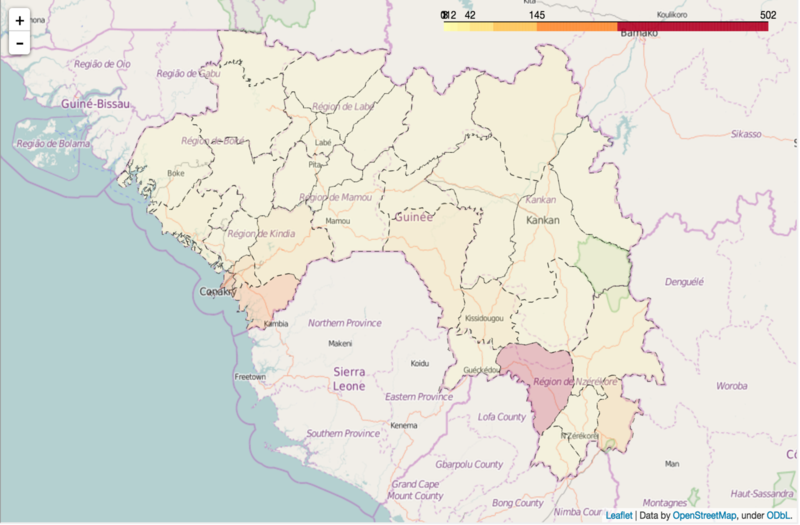

# Data Analysis for Social Impact - skill share session

Data analysis for social impact - what are the tools?

Material for the skill share session at the Geneva Impact
Hub: [Data analysis for social impact]
(https://geneva.impacthub.net/event/data-analysis-training-for-social-impact/)

Introduces you to [Open Refine], [jupyter] notebooks, and [python]. By the end
you will know how to take messy data from [HDX] and create an interactive
map like this:

You can [view the slides](http://htmlpreview.github.io/?https://github.com/wildtreetech/social-impact-teaser/blob/master/slides/index.html#/) online.

This is a preview for a two day course on [Data Science for Social Impact](http://www.wildtreetech.com/training/beyond-excel-spring-16.html). Contact
`tim@wildtreetech.com` directly for more information.

# Install instructions

* [Download Open Refine](http://openrefine.org/download.html), install and
  start it. Should open a new browser window. If not surf to `http://localhost:3333`
* Anaconda is a python distribution that is easy to install and contains
  a large number of commonly used libraries. [Download anaconda](https://www.continuum.io/downloads), make sure to get the `python3.5`
  version.

# Notebooks

1. [Intro to python](intro.ipynb)
1. [Intro to pandas](pandas.ipynb)
1. [Zurich bikes](zurich-velos.ipynb)
1. [Analysing ebola cases](ebola.ipynb)
1. [Intro to maps](static-maps.ipynb)
1. [Interactive maps](interactive-maps.ipynb)

# Try it out

You can try part of the material out live, in the cloud. Simply click
on the binder badge:

# Datasets

The [ebola] datset in this tutorial was downloaded from [HDX] and are
available there for free.

Guinea prefectures borders can be downloaded from
[GADM](http://www.gadm.org/country). Country: Guinea File Format: Shapefile
Gives you `GIN_adm_shp.zip`, extract it to `social-impact-teaser/gin_adm`.

The Zurich bike data comes from [Zurich Open Data](https://data.stadt-zuerich.ch).

# License

 Data Analysis for Social Impact by <a xmlns:cc="http://creativecommons.org/ns#" href="https://github.com/wildtreetech/social-impact-teaser" property="cc:attributionName" rel="cc:attributionURL">Tim Head</a> is licensed under a <a rel="license" href="http://creativecommons.org/licenses/by-nc-sa/4.0/">Creative Commons Attribution-NonCommercial-ShareAlike 4.0 International License</a>.

All images are from [unsplash](//unsplash.com). Ebola data are taken from HDX.

Thanks to [Peter Waller](//github.com/pwaller) for inspiration and GIFs.

[hdx]: https://data.hdx.rwlabs.org
[Ebola]: https://data.hdx.rwlabs.org/dataset/rowca-ebola-cases
[jupyter]: https://jupyter.org
[python]: https://python.org
[open refine]: https://openrefine.org
